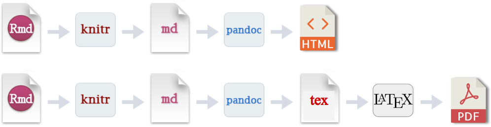

-   [YAML metadata (header) in R
    Markdown](#yaml-metadata-header-in-r-markdown)
-   [Useful websites](#useful-websites)
-   [useful tools](#useful-tools)
-   [Terminology and norms](#terminology-and-norms)
-   [Basic](#basic)
    -   [Syntax](#syntax)
    -   [Basic setting metadata](#basic-setting-metadata)
-   [advanced options for html and
    pdf](#advanced-options-for-html-and-pdf)
    -   [html](#html)
    -   [pdf](#pdf)
-   [Bibliographies and Citations](#bibliographies-and-citations)
-   [Chinese support](#chinese-support)
-   [params](#params)
-   [Pandoc arguments](#pandoc-arguments)
-   [shared options](#shared-options)
-   [Updating…](#updating)

# YAML metadata (header) in R Markdown

YAML is a human-readable and easy to write language to define data
structures.

Rmd makes it possible to use a YAML header to specify certain parameters
right at the beginning of the document. Built-in YAML parameters make it
easier to create more organized and informative reports. However, there
are few tutorials or summarized articles to display all the settings and
parameters for `YAML metadata` in R Markdown. This readme file give you
the power to easily control R Markdown by YAML.

# Useful websites

-   <https://rmarkdown.rstudio.com/formats.html> — R Markdown formats
    from RStudio
-   <https://www.r-bloggers.com/2020/08/useful-yaml-options-for-generating-html-reports-in-r/>
    — Useful YAML options for generating HTML reports in R

# useful tools

-   <https://ymlthis.r-lib.org/index.html> — ymlthis: a package for
    writing YAML for R Markdown

-   <https://github.com/kamapu/yamlme> — This package aims to save
    documents with their respective settings (yaml-head) in R-objects.

# Terminology and norms

-   R lang – use upper case letter `R`
-   Rmd – capitalizes the first letter for `Rmd` files
-   R Markdown – the R Markdown module or notebook of Rstudio
-   rmarkdown – the package of `rmarkdown`
-   YAML – /ˈjæməl/ a recursive acronym for “YAML Ain’t Markup Language”
-   YAML header/metadata – the settings data written by YAML in Rmd
    header
-   All the YAML metadata are `lower case letters` except file paths or
    file names

# Basic

## Syntax

### Data Structure

Source: ymlthis package(Barrett and Iannone 2021) vignette

A YAML code block should be fenced in with `---` before and after (you
can also use … to end the YAML block, but this is not very common in R
Markdown).

1.  Scalars, or variables, are defined using a colon and a **space**.A
    dictionary is represented in a simples `key: value` form (the colon
    must be followed by a `space`)

        ---
        title: "YAML metadata for R Markdown with examples"
        author: Hao Liang
        fontsize: 12pt
        ---

2.  All members of a list are lines beginning at the same indentation
    level starting with a `'- '` (a dash and a space):

        # A list of tasty fruits
        - Apple
        - Orange
        - Strawberry
        - Mango

        # OR
        [Apple, Orange, Strawberry, Mango]

3.  More complicated data structures are possible, such as lists of
    dictionaries, dictionaries whose values are lists or a mix of both:

        author: 
         - Name_1   # can be indented or not
         - Name_2   # but be consistent among different entries

4.  Dictionaries and lists can also be represented in an abbreviated
    form if you really want to:

        author: [Name_1, Name_2]

5.  Strings can be denoted with a `|` character, which preserves
    newlines, or a `>` character, which folds newlines.

        abstract: |
          One or two sentences providing a **basic introduction** to the field,  comprehensible     to a scientist in any discipline.

          Two to three sentences of **more detailed background**, comprehensible  to scientists     in related disciplines.

        abstract: >
          One or two sentences providing a **basic introduction** to the field,  comprehensible     to a scientist in any discipline.

          Two to three sentences of **more detailed background**, comprehensible  to scientists     in related disciplines.

6.  Logical values in YAML are unusual: `true/false`, `yes/no`, and
    `on/off` are all equivalent to TRUE/FALSE in R. Any of these turn on
    the table of contents:

        toc: true
        toc: yes
        toc: on

### Indent

In YAML, spaces(indent) are used to indicate nesting (`tab` is not
recommended.). When we want to specify the output function
`pdf_document(toc = TRUE)`, we need to nest it under the `output` field.
We also need to nest `toc` under pdf\_document so that it gets passed to
that function correctly.

    ---
    output:
      pdf_document:
        toc: true
    ---

In R, the equivalent structure is a nested list, each with a name:
`list(output = list(pdf_document = list(toc = TRUE)))`. Similarly, you
can call this in R Markdown using the metadata object,
e.g. `metadata$output$pdf_document$toc`. The hierarchical structure
(which you can see with `draw_yml_tree()`) looks like this:

    └── output:
        └── pdf_document:
            └── toc: true

Without the extra indents, YAML doesn’t know toc is connected to
`pdf_document` and thinks the value of `pdf_document` is NULL. YAML that
looks like this:

    output:
      pdf_document:
    toc: true

    ├── output:
    │   └── pdf_document: null
    └── toc: true

Some YAML fields take unnamed vectors as their value. You can specify an
element of the vector by adding a new line and - (note that the values
can be indented or not below category here).

    category:
    - R
    - Reprodicible Research

### quote and R code

You may have noticed that strings in YAML don’t always need to be
quoted. However, it can be useful to explicitly wrap strings in quotes
when they contain special characters like : and @.

    title: 'R Markdown: An Introduction'

R code can be written as inline expressions `` `r expr` ``. `yml_code()`
will capture R code for you and put it in a valid format. R code in
`params` needs to be slightly different: use `!r`(e.g. `!r expr`) to
call an R object.

    author: 'liang'
    params:
      date: !r Sys.Date()

## Basic setting metadata

### Top-level basic settings

These settings are based on the original `rmarkdown` package without any
other associated packages.

Set Top-level Basic R Markdown YAML Fields. e.g.

    ---
    title: "YAML metadata for R Markdown with examples"
    subtitle: "YAML header"
    author: Hao Liang
    date: "2021-04-21"
    output:
      md_document:
        toc: yes
        toc_depth: 2
    abstract: YAML is a human-readable and easy to write language to define data structures.
    keywords: ["YAML", "Rmd"]
    subject: Medicine
    description: Rmd makes it possible to use a YAML header to specify certain parameters right at the beginning of the document.
    category: 
     - Rmd
     - Medicine
    lang: "en-US" 
    ---

This field is not available in all output formats. It is available in:

<table>
<colgroup>
<col style="width: 13%" />
<col style="width: 15%" />
<col style="width: 14%" />
<col style="width: 15%" />
<col style="width: 14%" />
<col style="width: 26%" />
</colgroup>
<thead>
<tr class="header">
<th>field</th>
<th>html_document</th>
<th>pdf_document</th>
<th>word_document</th>
<th>odt_document</th>
<th>powerpoint_presentation</th>
</tr>
</thead>
<tbody>
<tr class="odd">
<td>subtitle</td>
<td>:smiley:</td>
<td>:smiley:</td>
<td>:smiley:</td>
<td></td>
<td></td>
</tr>
<tr class="even">
<td>abstract</td>
<td>:smiley:</td>
<td>:smiley:</td>
<td></td>
<td></td>
<td></td>
</tr>
<tr class="odd">
<td>keywords</td>
<td>:smiley:</td>
<td>:smiley:</td>
<td>:smiley:</td>
<td>:smiley:</td>
<td>:smiley:</td>
</tr>
<tr class="even">
<td>subject</td>
<td>:smiley:</td>
<td>:smiley:</td>
<td>:smiley:</td>
<td>:smiley:</td>
<td>:smiley:</td>
</tr>
<tr class="odd">
<td>description</td>
<td></td>
<td></td>
<td>:smiley:</td>
<td>:smiley:</td>
<td>:smiley:</td>
</tr>
<tr class="even">
<td>category</td>
<td></td>
<td></td>
<td>:smiley:</td>
<td></td>
<td>:smiley:</td>
</tr>
<tr class="odd">
<td>lang</td>
<td>:smiley:</td>
<td>:smiley:</td>
<td>:smiley:</td>
<td>:smiley:</td>
<td>:smiley:</td>
</tr>
</tbody>
</table>

The document language using IETF language tags such as “en” or “en-US.”
The [language subtag lookup tool](https://r12a.github.io/app-subtags/)
can help find the appropriate tag.

> Certain R Markdown templates will allow you to specify additional
> parameters directly within the YAML. For example, the Distill output
> format allows url, affiliation, and affiliation\_url to be specified.
> After you install the distill package. You can see the corresponding
> section in this tutorial.

    ---
    title: "Distill for R Markdown"
    author:
      - name: "JJ Allaire"
        url: https://github.com/jjallaire
        affiliation: RStudio
        affiliation_url: https://www.rstudio.com
    output: distill::distill_article
    ---

### output

The `output` field of YAML is very important for R Markdown. The
`rmarkdown` package contains a lot of output formats for different use.

Source: <https://rmarkdown.rstudio.com/lesson-9.html>

    ---
    output: html_notebook
    ---

The `rmarkdown` package/ Rmd natively support the following formats:

-   html\_notebook
-   html\_document
-   pdf\_document
-   word\_document
-   odt\_document
-   rtf\_document
-   md\_document
-   ioslides\_presentation
-   beamer\_presentation
-   powerpoint\_presentation
-   html\_vignette

If you use one output format without additional arguments, the value of
output can simply be the name of the function.

    ---
    output: html_document
    ---

However, if you’re specifying more than one output type, you must use
the nesting syntax. If you don’t want to include additional arguments,
use “default” as the function’s value.

    ---
    output:
      html_document: default
      pdf_document: default
    ---

### toc

`toc` is the sub-level option of any output formats. You can add a table
of contents (TOC) using the `toc` option and specify the depth of
headers that it applies to using the `toc_depth` option(Xie 2018). For
example:

    ---
    title: "Habits"
    output:
      html_document:
        toc: true
        toc_depth: 2
        toc_float: # invalid for other output formats of non-html
          collapsed: false
          smooth_scroll: false
    ---

# advanced options for html and pdf

R Markdown stands on the shoulders of `knitr` and Pandoc(**xie2020?**).
html and pdf are the most common formats outputted by R Markdown, most
other formats are also transformed from them. From the figure below, we
clearly see the difference for generating html and pdf. .md files can be
directly converted to html, but md -&gt; pdf is time-consuming and
depends on tex(R Markdown documents are converted to PDF by first
converting to a TeX file and then calling the LaTeX engine to convert to
PDF. ). So the options for these two formats are not always compatible.

## html

html full YAML example:

    ---
    output:
      html_document:
        code_folding: hide #choose to hide/show code blocks initially.
        number_sections: true # add section numbering to headers
        theme: united # Bootstrap theme (themes are drawn from the Bootswatch theme library)
        highlight: tango #specifies the syntax highlighting style
        css: styles.css # custom CSS ( set the theme and potentially highlight to null)
        fig_width: 7 # Figure options
        fig_height: 6
        fig_caption: true
        df_print: paged # tables are printed as HTML tables with support for pagination
        self_contained: false # keep dependencies in external files
        keep_md: true # keep a copy of the Markdown file
        includes:
          in_header: header.html # inject CSS and JavaScript code into the <head> tag
          before_body: doc_prefix.html # include a header that shows a banner or logo.
          after_body: doc_suffix.html # include a footer
        template: template.html # custom templates
        md_extensions: -autolink_bare_uris+hard_line_breaks # preface an option with '-' to disable and '+' to enable itpreface an option with - to disable and + to enable it
    ---

## pdf

### pdf full YAML example for output:

    ---
    output:
      pdf_document:
        toc: true
        number_sections: true
        fig_width: 7
        fig_height: 6
        fig_caption: true
        df_print: kable # print.data.frame(default)/kable/tibble
        highlight: tango
        latex_engine: xelatex # try to use xelatex as default
        keep_tex: true
        keep_tex: true
        template: template.tex
        includes:
          in_header: preamble.tex
          before_body: doc-prefix.tex
          after_body: doc-suffix.tex
    ---

### pdf top-level YAML example

Many aspects of the LaTeX template used to create PDF documents can be
customized using top-level YAML metadata (note that these options do not
appear underneath the output section, but rather appear at the top level
along with title, author, and so on)(**xie2018?**). For example:

    ---
    output: pdf_document
    fontsize: 11pt
    geometry: margin=1in
    documentclass: ctexart # usually one of the standard classes, article, book, and report
    classoption:
     - twocolumn
     - landscape
    linestretch: 2 adjusts line spacing using the setspace package, e.g. 1.25, 1.5
    indent: true 
    papersize: a4 # paper size, e.g. letter, a4
    ---

consult the Pandoc manual for the [full
list](https://pandoc.org/MANUAL.html#variables-for-latex)

### header-includes:

    ---
    output: pdf_document
    header-includes:
     - \usepackage{fancyhdr}
     - \pagestyle{fancy}
     - \fancyhead[L]{MANUSCRIPT AUTHORS}
     - \fancyhead[R]{MANUSCRIPT SHORT TITLE}
     - \usepackage{lineno}
     - \linenumbers
    ---

# Bibliographies and Citations

<https://rmarkdown.rstudio.com/authoring_bibliographies_and_citations.html>

# Chinese support

# params

# Pandoc arguments

# shared options

If you want to specify a set of default options to be shared by multiple
documents within a directory, you can include a file named \_output.yml
within the directory. Note that no YAML delimiters (—) or the enclosing
output field are used in this file. For example:

    html_document:
      self_contained: false
      theme: united
      highlight: textmate

# Updating…

Barrett, Malcolm, and Richard Iannone. 2021. *Ymlthis: Write ’YAML’ for
’r Markdown’, ’Bookdown’, ’Blogdown’, and More*.
<https://CRAN.R-project.org/package=ymlthis>.

Xie, Yihui. 2018. *R Markdown: The Definitive Guide*.
<https://doi.org/10.1201/9781138359444>.
